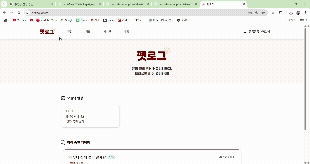

 

 

## 🕵️ 팀원 소개

> **[한화시스템 BEYOND SW캠프 12기] Final Project**  
> Team Hot6🔥

|            |          |        |      |
| :--------------------------------------------------------------: | :----------------------------------------------------------: | :--------------------------------------------------------: | :--------------------------------------------------------: |
| 🐳 **박동휘** [@parkdonghwi-git](https://github.com/donghwi) | 🐢 **유승호** [@seungho99](https://github.com/seungho99) | 🧶 **박세연** [@yeon7485](https://github.com/yeon7485) | ⚽ **안규호** [@Ahngyuho](https://github.com/Ahngyuho) |

 

### 목차

- [🐶 기술 스택](#-기술-스택)
- [🐹 펫로그 서비스 소개](#-펫로그-서비스-소개)
- [🐦 프론트엔드 프로젝트 목표](#-프론트엔드-프로젝트-목표)
- [🐟 프로젝트 설계](#-프로젝트-설계)
- [🐢 핵심 로직 상세 설명](#-핵심-로직-상세-설명)
- [🦎 프로젝트 폴더 바로가기](#-프로젝트-폴더-바로가기)

 
 

## 🐶 기술 스택

### 🎨 Frontend

 <!-- Vue.js -->
 <!-- 상태관리 라이브러리 -->

 <!-- Nginx -->

### 🧠 Backend

 <!-- 스프링 부트 -->
 <!-- 인증/인가 -->
 <!-- 클라우드 마이크로서비스 -->

### 🗄 DB

### ⚙️ CI/CD

 <!-- 컨테이너화 -->
 <!-- 오케스트레이션 -->
 <!-- CI/CD -->

### 💻 Etc

 <!-- 형상 관리 -->
 <!-- GitHub -->

 

## 🐹 펫로그 서비스 소개

#### 프로젝트 배경
- 반려동물 케어의 모든 것, 하나의 플랫폼으로 통합된 Petlog 서비스  

반려동물을 돌보는 일은 단순한 애정 표현을 넘어 체계적인 관리와 지속적인 관심이 필요한 일이다. 
그러나 현재 제공되는 서비스는 콘텐츠 소비나 단편적인 일정 기록에 그치는 경우가 많고, 이러한 기능들이 하나로 통합된 플랫폼은 매우 드문 실정이다. 
우리는 반려동물의 건강과 일상을 기록하고 관리할 수 있는 기능과 더불어, 반려인 간의 소통과 정보 공유를 가능하게 하는 커뮤니티 기능까지 아우르는 Petlog 서비스를 구축하였다.
 

- `통합 반려동물 관리` : 단순한 스케줄러가 아닌, 반려동물의 병원 방문, 예방접종, 산책, 미용 등 다양한 일정을 통합적으로 등록 및 조회하며 건강 상태를 지속적으로 관리할 수 있도록 지원한다. 
- `일상 기록 및 건강 모니터링` : 하루 단위로 사진, 이상 행동, 식사량 등 다양한 정보를 기록하고, 누적된 데이터를 기반으로 반려동물의 건강 변화를 추적한다. 
- `위치 기반 탐색 기능` : 현재 위치를 중심으로 가까운 동물병원, 미용실 등 주요 반려동물 관련 시설을 손쉽게 탐색할 수 있어 유사시 빠르게 대처 가능하다. 
- `스마트 알림 시스템` : 등록된 일정을 실시간으로 알림 받아 누락 없이 일정을 챙길 수 있으며, 반복 일정도 편리하게 설정 가능하다. 
- `그룹 채팅 및 커뮤니티 게시판` : 반려인들끼리 그룹 채팅을 통해 소통하고, 일정이나 반려동물 정보를 카드 형태로 공유할 수 있으며, 정보 공유/자유/Q&A 게시판을 통해 궁금증을 해소하고 다양한 팁을 나눌 수 있다. 
- `AI 기반 Q&A 지원` : Q&A 게시판에서는 질문에 대해 사용자와 **AI**가 함께 답변을 제공함으로써 빠르고 정확한 정보 획득이 가능하다. 

#### 세부 기능

- **`📇 반려동물 카드`** 
  반려동물 정보를 카드 형식으로 등록 및 관리
- **`📆 일정 관리`** 
  단순한 스케줄러가 아닌, 반려동물의 병원 방문, 예방접종, 산책, 미용 등 다양한 일정을 통합적으로 등록 및 조회하며 반려동물 지속적으로 관리할 수 있도록 지원
- **`🧾 일일 기록`** 
  반려동물의 건강 상태, 이상 현상, 오늘의 사진 등 일일 단위로 기록 및 관리
- **`📍 위치 기반 탐색`** 
  현재 위치를 기준으로 주변 동물병원, 펫샵 등의 반려동물 시설 탐색
- **`🔔 일정 알림`** 
  스케줄 알림을 실시간 알림으로 받아볼 수 있는 기능
- **`💬 그룹 채팅 및 이벤트 채팅방`** 
  사용자들이 실시간으로 소통하고, 채팅방에서 일정 또는 반려동물 카드도 함께 공유, 제한된 시간과 인원 안에서만 참여할 수 있는 이벤트 전용 채팅방 제공
- **`🪧 커뮤니티 게시판 및 Q&A`** 
  반려인들이 자유롭게 소통하고 정보를 나눌 수 있는 자유게시판, 정보게시판, Q&A 게시판을 제공 + Q&A 게시판에서는 사용자와 AI가 함께 질문에 답변하며, 궁금증을 신속하고 정확하게 해결

 

## 🐦 프론트엔드 프로젝트 목표

- `로그인 후 주요 기능 바로가기` : 로그인 직후 사용자가 ‘나의 일정’, ‘나의 채팅방’으로 한 번에 접근 가능하도록 메인 페이지 UI/UX를 최적화하여 반복 사용 시 불필요한 탐색 절차를 줄이고 편의성을 극대화함
- `지도 기반 탐색 창` : 헤더의 지도 메뉴 클릭 시 내 위치를 기준으로 반경 2km 이내 동물병원 및 미용실 정보 제공
- `일정 알림 아이콘` : 등록된 일정에 대해 1시간 전에 알림 표시바를 통해 사용자에게 실시간 안내 제공
- `채팅 게시판 검색창` : 제목 또는 해시태그 기준으로 채팅방 및 게시글 검색 가능하도록 구현
- `마이페이지 권한 분기` : 관리자와 일반 유저에 따라 마이페이지 내 제공 기능 및 화면 구성 차별화
- `일정 분류 창` : 일정 페이지에서 반려동물별 일정과 전체 일정을 구분하여 확인 가능하도록 구현

## 🐟 프로젝트 설계

#### [1. 기획서 바로가기](https://docs.google.com/document/d/1VGoL4hW_HWG3-ZIIZwwbtjm14G55dLhh8RdMGFEjTf4/edit?usp=sharing)

#### [2. 요구사항 정의서](https://docs.google.com/spreadsheets/d/1-6Z2yJZRFkM0Ix6biRMdWBmkby0E4XW_g9UfPiDfsH4/edit?usp=sharing)

#### [3. WBS](https://docs.google.com/spreadsheets/d/10GJK2OFHPAkFplNyjtBtaEh8kxCxARNC_aAOHAJr77M/edit?usp=sharing)

#### [4. 화면설계서 바로가기](https://www.figma.com/design/7sBqcCVXnFPHhrHAJN9N9l/Petlog?node-id=0-1&t=6T5v5WcuWWnwHpGS-1)

 

## 🦔 주요 기능 시연

회원가입

> 이메일, 비밀번호, 닉네임으로 회원 가입을 한다.
> 이메일 인증 버튼을 누른후 실제 이메일 메일함에서 **이메일 인증**을 한다  
> 이메일, 닉네임은 **중복이 불가능**하다.

로그인

  

> 일반 로그인, 카카오 로그인
> 이메일, 비밀번호를 입력하여 로그인한다.
> 카카오 로그인은 카카오로 로그인 버튼을 누르면 로그인 된다.

메인 페이지

> 헤더에 일정, 지도, 게시판, 채팅으로 이동한다.
> 나의 일정, 나의 채팅 한눈에 볼수 있고 이동도 가능하다.

일정/기록

### 전체 일정 조회

> 전체 반려동물 일정을 한번에 조회 한다.
---

### 반려동물별 일정 조회

> 반려 동물별 일정을 조회 한다.
---

### 일정 생성 & 상세 정보

> 반려동물, 카테고리, 날짜를 선택하고 일정 명과 상세정보를 기입한후 장소가 있다면 
장소도 선택한다.

---

### 기록 생성

> 반려동물 기록 카테고리를 선택하고 기록 정보를 기입한다.
---

### 기록 상세

> 기록에 대한 정보를 각 기록을 누르면 상세정보를 볼수 있다.
---

주변 장소 조회

> 사용자에게 동물 병원, 미용실을 기본적으로 제공 한다.
> 사용자가 다른 정보를 원하면 검색하여 위치를 검색할수 있다.

자유/정보공유 게시판

### 게시판 목록 & 조회

> 게시판 목록은 10개로 끊어서 한페이지에 보여주고 다음페이지에 다음 게시물을 볼수 있다.

---

### 게시글 등록

> 게시글은 제목과 내용을 적고 반려동물 카드와 사진을 등록할수 있다. 

---

### 댓글 등록

> 사용자는 각 게시글에 댓글을 작성할수 있다. 

Q&A 게시판

### 질문 목록 상세 조회회

> 각 사용자들인 올린 Q&A를 조회한다.
---

### 질문 등록 & AI 답변

> 사용자는 궁금한 내용과 제목을 적고 올리면 자동으로 AI답변이 먼저 달린후 
사용자들이 답변을 적을수 있다. 

---

### 답변 등록

> 사용자가 질문을 올리면 답변을 달수 있다. 
---

### 답변 채택

> 답변 채택 해서 채택한 답변으로 해서 질문에 답변을 적을수 없다.

그룹 채팅

### 채팅방 목록

> 각 사용자들이 만든 방을 들어가고 조회 할수 있다

---

### 채팅방 생성

> 원하는 채팅방 이름과 해시태그를 설정 할수 있다.
---

### 채팅 기능

> 서로 실시간 웹소켓 통신으로 반려동물 카드 정보를 공유 하며
채팅 한다. 
---

마이페이지 - 반려동물 카드

### 반려동물 카드 목록

> 반려 동물 카드들의 목록을 볼수 있다.

---

### 카드 생성

> 나의 반려동물 이름 나이 성별 중성화 유무 사진 등을 기입할수 있다.

마이페이지 - 내 정보

### 내 정보 조회

> 나의 이메일 닉네임과 내 댓글, 나의 글, 나의 질문, 나의 답변을 볼수 있다.
---

### 내 정보 수정

> 나의 프로필 사진 및 닉네임을 수정 할수 있다. 

관리자

### 카테고리 목록 및 등록

> 관리자가 유저들이 요청한 카테고리를 추가 하고 관리한다.
---

### 이벤트 채팅방 생성

> 이벤트 채팅방 생성 하여 인원을 제한하고 시간을 제한해서 못들어오게 한다.

 

## 🐢 핵심 로직 상세 설명

### [📃 프로젝트 Wiki](https://github.com/beyond-sw-camp/be12-fin-HOT6-Petlog-FE/wiki)  

 

## 🐷 프로젝트 폴더 바로가기

### [🗂️ Backend](https://github.com/beyond-sw-camp/be12-fin-HOT6-Petlog-BE)
### [🗂️ Devops](https://github.com/beyond-sw-camp/be12-fin-HOT6-Petlog-BE/tree/main/backend/devops)

